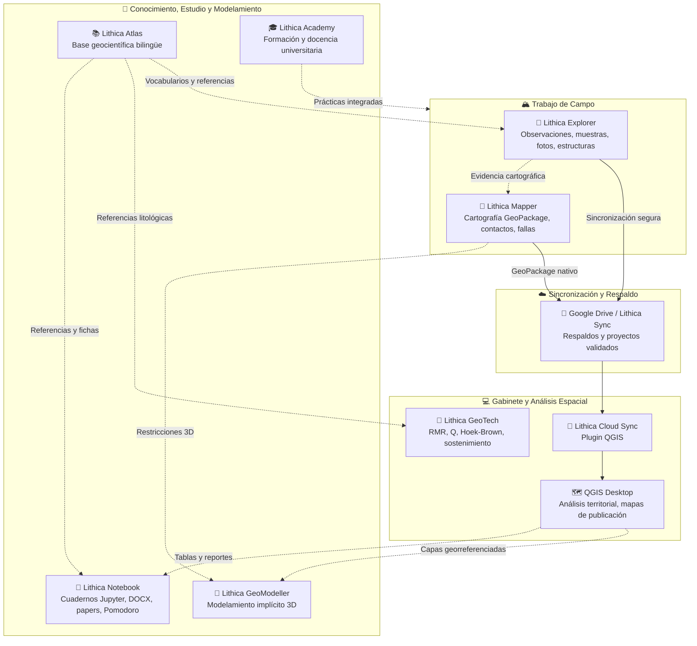

# 🌍 Lithica Suite

> **Ecosistema geocientífico digital integrado para trabajo de campo, cartografía geológica, sincronización en la nube, geotecnia, modelamiento 3D y educación.**

---

## Portada del Ecosistema

**Lithica Suite** es una suite de herramientas diseñada para resolver la fragmentación del flujo geológico tradicional. Conecta la captura de observaciones en el terreno con la cartografía digital en tablet, la sincronización automática con sistemas de información geográfica de escritorio (QGIS), la clasificación geomecánica, la lectura y estudio técnico sin conexión, la consulta rigurosa de conocimiento geológico y el modelamiento estructural.

Este repositorio es la **página frontal (front page / landing hub)** y el **centro oficial de releases** del ecosistema en GitHub. El código fuente de cada aplicación reside de forma modular en sus propios repositorios especializados.

---

## 📱 Aplicaciones de Lithica Suite

### [Lithica Explorer](https://gisgeo.dev/es/portfolio/lithica-explorer)
**Captura y gestión de evidencia geológica de campo.**
Aplicación Android disponible en Google Play para trabajo de campo con soporte completo offline, mapas ráster y vectoriales, capas espaciales, observaciones georreferenciadas con multimedia (fotos, audio, notas), columnas estratigráficas interactivas y clasificación guiada de rocas ígneas y sedimentarias.
- 🔗 **Web:** [gisgeo.dev/es/portfolio/lithica-explorer](https://gisgeo.dev/es/portfolio/lithica-explorer)
- 🛒 **Google Play:** [Descargar en Google Play Store](https://play.google.com/store/apps/details?id=com.gisgeodev.lithicaexplorer)
- 📄 **Ficha técnica:** [apps/LITHICA_EXPLORER.md](apps/LITHICA_EXPLORER.md)

### [Lithica Mapper](https://gisgeo.dev/es/portfolio/lithica-mapper)
**Cartografía geológica digital en tablet con stylus.**
Aplicación Android disponible en Google Play orientada a la creación y edición cartográfica profesional. Incorpora dibujo con lápiz y navegación táctil, gestión de unidades, contactos, fallas y símbolos geológicos USGS, proyectos en GeoPackage nativo, georreferenciación de imágenes y GeoPDF, y soporte real de CRS geográficos y proyectados.
- 🔗 **Web:** [gisgeo.dev/es/portfolio/lithica-mapper](https://gisgeo.dev/es/portfolio/lithica-mapper)
- 🛒 **Google Play:** [Descargar en Google Play Store](https://play.google.com/store/apps/details?id=com.gisgeodev.lithicamapper)
- 📄 **Ficha técnica:** [apps/LITHICA_MAPPER.md](apps/LITHICA_MAPPER.md)

### [Lithica Cloud Sync](https://gisgeo.dev/es/portfolio/lithica-cloud-sync)
**Puente de sincronización entre campo y QGIS de escritorio.**
Plugin oficial para QGIS que descubre, valida, descarga y abre automáticamente proyectos de Lithica Explorer y Lithica Mapper sincronizados mediante Google Drive. Carga capas, simbología USGS y estilos temáticos respetando el sistema de coordenadas.
- 🔗 **Web:** [gisgeo.dev/es/portfolio/lithica-cloud-sync](https://gisgeo.dev/es/portfolio/lithica-cloud-sync)
- 🐙 **GitHub:** [github.com/jordan-zav/Lithica-Cloud-Sync](https://github.com/jordan-zav/Lithica-Cloud-Sync)
- 📄 **Ficha técnica:** [apps/LITHICA_CLOUD_SYNC.md](apps/LITHICA_CLOUD_SYNC.md)

### [Lithica Atlas](https://gisgeo.dev/es/portfolio/lithica-atlas)
**Atlas geocientífico interactivo y bilingüe.**
Aplicación disponible en Google Play y Windows con doce colecciones consultables: minerales, rocas, texturas micrográficas, fósiles, alteraciones hidrotermales, modelos de yacimientos, diagramas, guías y geoquímica. Funcionamiento offline completo y fichas detalladas con referencias y atribuciones trazables.
- 🔗 **Web:** [gisgeo.dev/es/portfolio/lithica-atlas](https://gisgeo.dev/es/portfolio/lithica-atlas)
- 🛒 **Google Play:** [Descargar en Google Play Store](https://play.google.com/store/apps/details?id=com.gisgeodev.lithica.atlas)
- 📄 **Ficha técnica:** [apps/LITHICA_ATLAS.md](apps/LITHICA_ATLAS.md)

### [Lithica GeoTech](https://gisgeo.dev/es/portfolio/lithica-geotech)
**Consulta y cálculo geotécnico para ingeniería y minería.**
Aplicación en desarrollo activo para Android y Windows que integra clasificaciones geomecánicas RMR (73, 76, 89, 14), Q-System con carta interactiva de soporte, criterio de falla Hoek-Brown 2002, compendio de métodos sugeridos ISRM y base de conocimiento de propiedades mecánicas.
- 🔗 **Web:** [gisgeo.dev/es/portfolio/lithica-geotech](https://gisgeo.dev/es/portfolio/lithica-geotech)
- 🧪 **Acceso Beta:** [Solicitar acceso a la Beta](https://forms.gle/GtNmVjVvpPzs2q5u6)
- 📄 **Ficha técnica:** [apps/LITHICA_GEOTECH.md](apps/LITHICA_GEOTECH.md)

### [Lithica Notebook](https://gisgeo.dev/es/portfolio/lithica-notebook)
**Lector offline de notebooks Jupyter y documentos científicos.**
Aplicación multiplataforma para Android y Windows orientada a la consulta, lectura y estudio técnico sin conexión. Soporta cuadernos computacionales (`.ipynb`), documentos Word con visor web local y exportación visual a PDF (`.docx`), documentos técnicos (`.pdf`), Markdown (`.md`, `.qmd`, `.rmd`), LaTeX (`.tex`), tablas y bases de datos SQLite (`.xlsx`, `.csv`, `.sqlite`), además de una agenda de estudio con Pomodoro persistente y preservación no destructiva de archivos.
- 🔗 **Web:** [gisgeo.dev/es/portfolio/lithica-notebook](https://gisgeo.dev/es/portfolio/lithica-notebook)
- 📄 **Ficha técnica:** [apps/LITHICA_NOTEBOOK.md](apps/LITHICA_NOTEBOOK.md)

### [Lithica GeoModeller](apps/LITHICA_GEOMODELLER.md)
**Modelamiento geológico 3D implícito.**
Módulo en fase de diseño conceptual para transformar las restricciones cartográficas, orientaciones estructurales y datos de sondaje generados por Explorer y Mapper en volúmenes y superficies tridimensionales reproducibles.
- 📄 **Ficha técnica:** [apps/LITHICA_GEOMODELLER.md](apps/LITHICA_GEOMODELLER.md)

### [Lithica Academy](apps/LITHICA_ACADEMY.md)
**Formación universitaria y profesional integrada.**
Plataforma educativa en fase de diseño orientada a conectar las herramientas de Lithica con lecciones, ejercicios prácticos de mapeo y casos de estudio reales para facultades de geología e ingeniería.
- 📄 **Ficha técnica:** [apps/LITHICA_ACADEMY.md](apps/LITHICA_ACADEMY.md)

---

## 🗺️ Matriz del Ecosistema y Disponibilidad

| Aplicación | Plataforma | Estado | Canal / Enlace Principal |
| :--- | :--- | :--- | :--- |
| **Lithica Explorer** | Android | Disponible (`v1.4.0+25`) | [Google Play](https://play.google.com/store/apps/details?id=com.gisgeodev.lithicaexplorer) · [Portafolio](https://gisgeo.dev/es/portfolio/lithica-explorer) |
| **Lithica Mapper** | Android | Disponible (`v0.3.0+6`) | [Google Play](https://play.google.com/store/apps/details?id=com.gisgeodev.lithicamapper) · [Portafolio](https://gisgeo.dev/es/portfolio/lithica-mapper) |
| **Lithica Cloud Sync** | QGIS Plugin | Disponible (`v2.0.3`) | [GitHub Releases](https://github.com/jordan-zav/Lithica-Cloud-Sync/releases) · [Portafolio](https://gisgeo.dev/es/portfolio/lithica-cloud-sync) |
| **Lithica Atlas** | Android · Windows | Disponible (`v1.0.0+11`) | [Google Play](https://play.google.com/store/apps/details?id=com.gisgeodev.lithica.atlas) · [Portafolio](https://gisgeo.dev/es/portfolio/lithica-atlas) |
| **Lithica GeoTech** | Android · Windows | Beta Activa | [Solicitar Beta](https://forms.gle/GtNmVjVvpPzs2q5u6) · [Portafolio](https://gisgeo.dev/es/portfolio/lithica-geotech) |
| **Lithica Notebook** | Android · Windows | MVP Funcional (`v0.1.0+1`) | [Portafolio](https://gisgeo.dev/es/portfolio/lithica-notebook) · [Ficha Técnica](apps/LITHICA_NOTEBOOK.md) |
| **Lithica GeoModeller**| Windows · Linux | Conceptual / Roadmap | [Ficha Técnica](apps/LITHICA_GEOMODELLER.md) |
| **Lithica Academy** | Web / Multiplataforma | Conceptual / Roadmap | [Ficha Técnica](apps/LITHICA_ACADEMY.md) |

---

## 🔄 Flujo de Trabajo Integrado

El principio fundamental de Lithica es que ningún dato debe quedar aislado en libretas de campo o formatos cerrados:

---

## 📦 Centro de Releases y Descargas

Este repositorio aloja los **releases oficiales unificados** para herramientas de escritorio, instaladores portables y APKs directas de la suite:

👉 **Visita el [Centro de Releases (RELEASES.md)](RELEASES.md)** para acceder a:
- Matriz completa de versiones vigentes y sumas de verificación SHA-256.
- Enlaces de descarga a paquetes de escritorio para Windows (`.zip` / `.exe`).
- Guía para crear y publicar nuevos lanzamientos utilizando GitHub Releases sin sobrecargar el repositorio Git.

---

## 🔬 Ecosistema Satélite y Herramientas Complementarias (GisGeo)

Además de los componentes centrales de la suite, el ecosistema cuenta con proyectos y librerías científicas complementarias:

| Proyecto | Descripción | Enlaces |
| :--- | :--- | :--- |
| **PetroPyQAPF** | Release académico oficial para clasificación QAPF/CIPW y petrografía con ML. | [Portafolio](https://gisgeo.dev/es/portfolio/petropyqapf) |
| **PeruSpatial Hub** | Plugin de QGIS para cargar servicios oficiales ArcGIS REST, WMS y WMTS del Perú con soporte de CRS. | [Portafolio](https://gisgeo.dev/es/portfolio/peruspatial-hub) · [GitHub](https://github.com/jordan-zav/Peruspatial-Hub) |
| **GeoNormPy** | Motor en Python para cálculo normativo CIPW y evaluación de saturación geoquímica. | [Portafolio](https://gisgeo.dev/es/portfolio/geonormpy) · [GitHub](https://github.com/jordan-zav/GeoNormPy) |
| **QGIS-RRIM** | Plugin de QGIS Processing para generar capas de terreno RRIM y compuestos RGB. | [Portafolio](https://gisgeo.dev/es/portfolio/qgis-rrim) · [GitHub](https://github.com/jordan-zav/QGIS-RRIM) |
| **MIRAGE** | Framework de visión y extracción de firmas morfológicas en rásteres multiespectrales. | [Portafolio](https://gisgeo.dev/es/portfolio/mirage) · [GitHub](https://github.com/jordan-zav/MIRAGE) |
| **MUSA** | Analizador de espectro multifractal para lineamientos estructurales en SIG. | [Portafolio](https://gisgeo.dev/es/portfolio/multiscale-multifractal-gis-framework) · [GitHub](https://github.com/jordan-zav/MUSA) |
| **Atlas de Depósitos** | Atlas web portable de depósitos minerales y franjas metalogenéticas del Perú. | [Portafolio](https://gisgeo.dev/es/portfolio/atlas-interactivo-depositos-minerales-peru) · [GitHub](https://github.com/jordan-zav/Atlas-Interactivo-de-Depositos-Minerales-del-Peru) |

---

  © 2026 GisGeo · Geociencia, Datos y Computación Aplicada · <a href="https://gisgeo.dev">gisgeo.dev</a>

