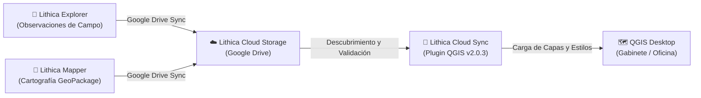

# Lithica Cloud Sync

**Plugin oficial para QGIS que descubre, valida, descarga y abre de forma segura proyectos de Lithica Explorer y Lithica Mapper sincronizados mediante Google Drive.**

---

## Enlaces Oficiales

- **Ficha en Portafolio:** [gisgeo.dev/es/portfolio/lithica-cloud-sync](https://gisgeo.dev/es/portfolio/lithica-cloud-sync)
- **Repositorio en GitHub:** [github.com/jordan-zav/Lithica-Cloud-Sync](https://github.com/jordan-zav/Lithica-Cloud-Sync)
- **Estado:** Disponible · Versión 2.0.3 (2026 - Presente)

---

## Propósito y Función

Lithica Cloud Sync es el puente de escritorio entre las aplicaciones móviles de campo ([Lithica Explorer](LITHICA_EXPLORER.md) y [Lithica Mapper](LITHICA_MAPPER.md)) y el entorno SIG profesional (QGIS).

Permite que geólogos, cartógrafos y equipos de oficina accedan de forma inmediata a los datos capturados en campo sin manipular cables, exportaciones manuales ni estructuras de carpetas complejas.

---

## Capacidades Principales

1. **Descubrimiento Automático:**
   - Detecta proyectos remotos almacenados en la carpeta de sincronización de Google Drive vinculada a Lithica.
   - Clasifica proyectos por origen: observaciones de Explorer o cartografía GeoPackage de Mapper.

2. **Validación y Seguridad:**
   - Comprueba la integridad de bases de datos SQLite / GeoPackage antes de abrirlas en QGIS.
   - Previene la corrupción de datos y la sobreescritura accidental.

3. **Carga Inteligente en QGIS:**
   - Configura automáticamente capas vectoriales, estilos temáticos, etiquetas y simbología geológica estándar USGS.
   - Respeta el Sistema de Referencia de Coordenadas (CRS) original del proyecto.

4. **Sincronización Bidireccional y Descarga:**
   - Descarga localmente versiones actualizadas para trabajar sin conexión a internet en gabinete.
   - Mantiene un registro de versiones y fechas de modificación.

---

## Integración en la Suite

---

## Requisitos e Instalación

- **QGIS:** Versión 3.22 LTR o superior.
- **Python:** 3.9+ (incluido en entornos QGIS estándar).
- **Cuenta Google:** Acceso a la cuenta donde se sincronizan los proyectos de campo de Lithica.
- **Instalación:** Disponible como complemento descargable `.zip` desde los [Releases de GitHub](https://github.com/jordan-zav/Lithica-Cloud-Sync/releases) o mediante el repositorio oficial de complementos de QGIS.